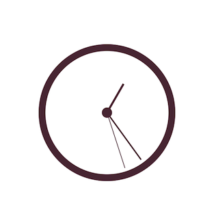

DFClock
=======

Customizable clock

Example in the project. 

Setup:
-------------------
 - Add DFCLockView folder to your project
 - In a storyboard add view to a viewcontroller
 - Set custom class of the view to DFCLockView in Identity inspector
 - You can customize with the following properties
    - radius
    - bigCircleWidth
    - littleCircleWidth
    - hourWidth
    - hourLength
    - minuteWidth
    - minuteLength
    - secondWidth
    - secondLength

- Set time you can use the time property. 
  ```
  [dfClockView setTime:[NSDate date] isAnimated:YES];
  ```



